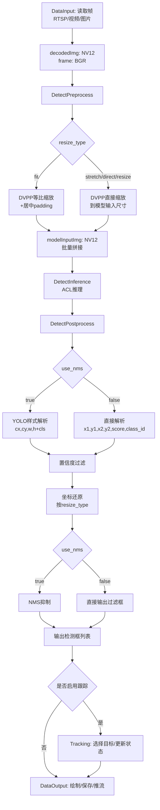

# 检测算法处理流程图

```mermaid
flowchart TD
    A[DataInput: 读取帧
RTSP/视频/图片] --> B[decodedImg: NV12
frame: BGR]
    B --> C[DetectPreprocess]
    C --> C1{resize_type}
    C1 -->|fit| C2[DVPP等比缩放
+居中padding]
    C1 -->|stretch/direct/resize| C3[DVPP直接缩放
到模型输入尺寸]
    C2 --> D[modelInputImg: NV12
批量拼接]
    C3 --> D
    D --> E[DetectInference
ACL推理]
    E --> F[DetectPostprocess]
    F --> F1{use_nms}
    F1 -->|true| F2[YOLO样式解析
cx,cy,w,h+cls]
    F1 -->|false| F3[直接解析
x1,y1,x2,y2,score,class_id]
    F2 --> F4[置信度过滤]
    F3 --> F4
    F4 --> F5[坐标还原
按resize_type]
    F5 --> F6{use_nms}
    F6 -->|true| F7[NMS抑制]
    F6 -->|false| F8[直接输出过滤框]
    F7 --> G[输出检测框列表]
    F8 --> G
    G --> H{是否启用跟踪}
    H -->|是| I[Tracking: 选择目标/更新状态]
    H -->|否| J[DataOutput: 绘制/保存/推流]
    I --> J
```

## 说明
- `resize_type=fit` 走等比缩放+padding；`resize_type=stretch/direct/resize` 走直接缩放。
- `use_nms=false` 时，后处理按 `[x1,y1,x2,y2,score,class_id]` 格式解析并直接输出过滤后的框。
